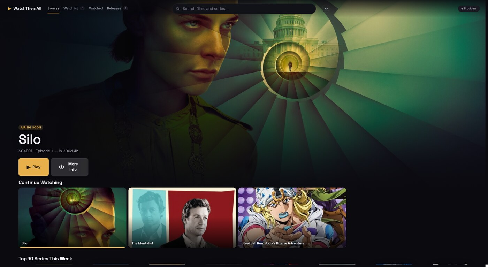
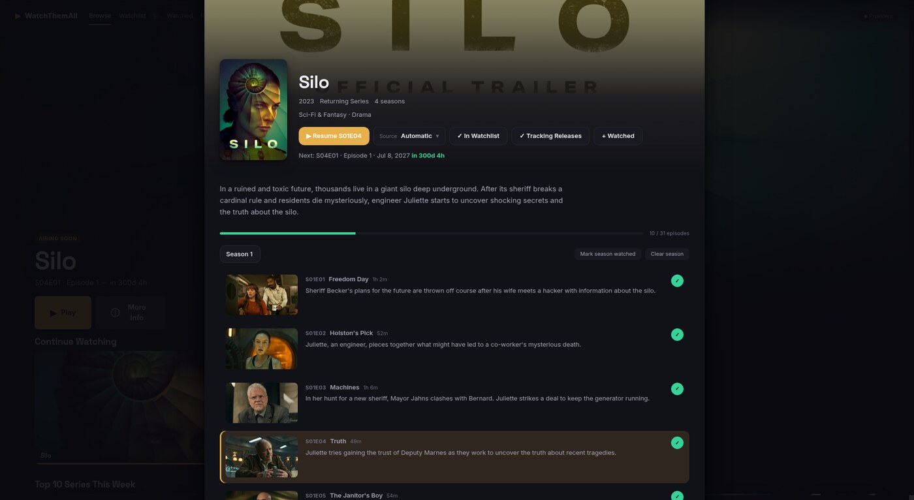

<div align="center">


# WatchThemAll

**One place for everything you're watching.**

Browse, track and resume films and series across the embed providers you
configure, on desktop and Android.

[](https://github.com/UserError418/WatchThemAll/releases/latest)
[](LICENSE)




</div>

---

## What it does

Embed sites don't remember what you watched, don't tell you when the next
episode airs, and no two of them look alike. WatchThemAll sits on top of the
ones you point it at and keeps the part that matters: your library.

- **A browse screen built from your library.** The hero shows whatever is most
  urgent for you — a tracked series airing this week, or something you're
  part-way through. Genre rows follow what you actually watch.
- **Resume where you stopped**, at the real position in the episode, including
  when you switch provider mid-show.
- **Release tracking.** Follow a series for a countdown in the app and a
  notification on the day.
- **Providers you control.** Enable, disable and reorder them. Automatic mode
  learns which one worked for which show and leads with that.
- **Automatic failover.** If a source stalls, the app moves to the next one on
  a five-second countdown you can cancel.
- **Skip intros** using community-maintained timestamps, shown only when the
  stream's length matches the episode it claims to be. One switch disables the
  feature and its lookups; see the [privacy policy](docs/PRIVACY.md).
- **One library on every device.** Sync pairs devices with a short code, the
  way you sign a TV into YouTube. There is no account and no server of ours
  involved.
- **Import and export.** Bring a library in from MyAnimeList, or take the whole
  thing out as one file.



## Get it

**[Download the latest release →](https://github.com/UserError418/WatchThemAll/releases/latest)**

| | |
|---|---|
| **Linux** | `.AppImage` — make it executable and run it. Also `.deb`. |
| **Windows** | `.exe` installer. |
| **macOS** | `.dmg`. |
| **Android** | `.apk` — sideload it. See [`mobile/`](mobile/README.md). |

Android runs the same app and the same library, laid out for a phone. The APK
is debug-signed, which is fine for sideloading but cannot upgrade an install
from another source. Uninstall first if you have one.

## Notices

**WatchThemAll hosts, streams, proxies and distributes no video.** It builds
URLs for third-party sites, opens them in a window, and records what you
watched.

**No affiliation, no endorsement.** This project has no relationship with the
sites it can be pointed at and no control over what they serve. Any entry can
be disabled, reordered or replaced with your own.

**Metadata** and artwork come from [TMDB](https://www.themoviedb.org/). This
product uses the TMDB API but is not endorsed or certified by TMDB.

## How it works

**Playback is an embed page inside the app.** Both apps frame the provider and
draw their own controls over it. That frame is how the app reads the video's
real position — resume, watched state and stall detection all come from it —
and it is where pop-ups and unsolicited navigation are denied.

**Everything else is one codebase.** The interface, the design system, the
provider logic and the store are written once and run in both apps. The
platform boundary is a single TypeScript interface, which is why the Android
app is a port rather than a second product.

**Your library is one JSON file on your own machine.** No account, no server,
no telemetry. Export it, import it, or open it in a text editor.

Sync mirrors that file into a single file in **your own Google Drive**. The app
can only touch files it created itself; the rest of your Drive is invisible to
it. Your devices talk to Google directly, and nothing passes through us.

## Build it

```bash
npm install
npm run dev            # desktop, with hot reload
npm run build:linux    # or :win / :mac
npm run apk            # Android; needs JDK 21 + Android SDK
```

The Android build needs JDK 21 and the Android SDK. The script that installs
both is not published — see "What is not in this repository".

## Contributing

Issues and pull requests are welcome. Please don't open either to add new
streaming sources; the provider list is not crowd-sourced.

`npm run lint`, `npm run typecheck` and `npm test` should pass before a PR.

- [`docs/PROVIDERS.md`](docs/PROVIDERS.md) — the provider catalogue
- [`docs/PRIVACY.md`](docs/PRIVACY.md) — what the app sends, and what it stores
- [`mobile/README.md`](mobile/README.md) — the Android app

## What is not in this repository

Two things are maintained but deliberately unpublished, and the source refers
to them in passing:

- **`scripts/`** — the build, deploy, release and provisioning tooling, plus
  the development harness that drives a running app over the DevTools
  protocol. Some of it installs onto a named machine over SSH. The practical
  consequence is that **`npm run apk` will not work in a clone**, because it
  points at `scripts/build-apk.sh`. Every other script in `package.json` —
  `dev`, `build`, `lint`, `typecheck`, `test` — is self-contained and works.
- **The long-form design documents.** Comments in the source occasionally cite
  them by name. Treat those as a pointer to reasoning that is not public
  rather than to a file you are expected to find.

## Licence

[MIT](LICENSE).
